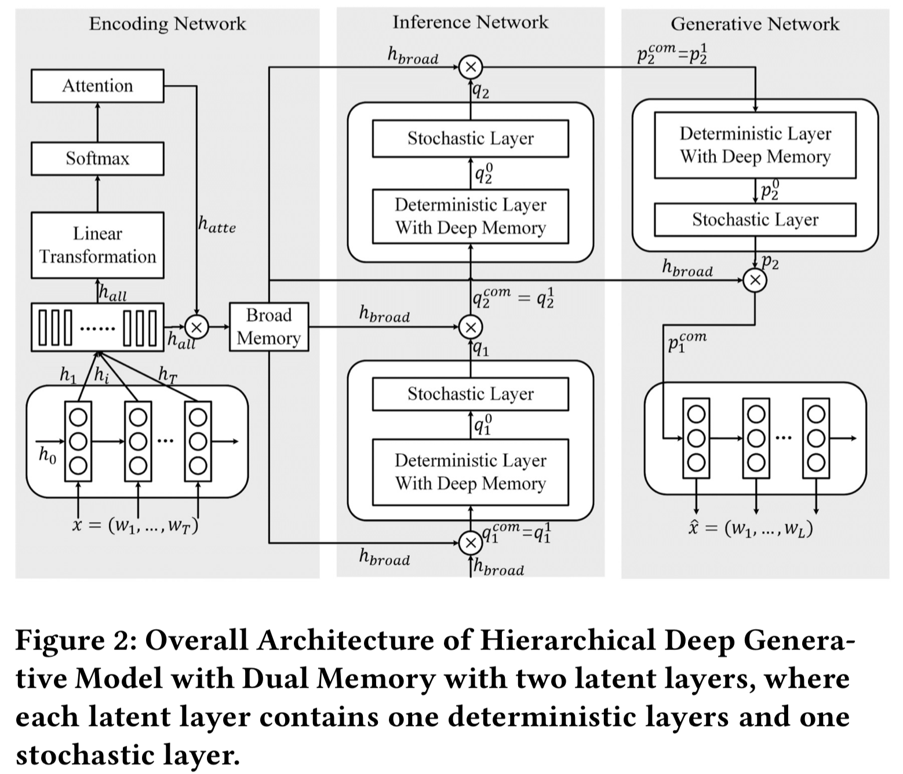

## Hierarchical Deep Generative Models with Dual Memory

A TensorFlow implementation of the Hierarchical Deep Generative Models with Dual Memory described in
[**Sequence Modeling with Hierarchical Deep Generative Models with Dual Memory**](https://dl.acm.org/citation.cfm?id=3132952), published as a long paper in CIKM2017.
Please refer to the paper for more details.

This repository also implements baseline model: Variational Autoencoder for Sentences described in [**Generating Sentences from a Continuous Space**](https://arxiv.org/abs/1511.06349) for comparison.

## Introduction

This paper proposes Hierarchical Deep Generative Models with Dual Memory (HDGM for short) to address the ineffective difficulties in discrete sequence modeling.
It is architecturally based on the latent variable model framework, and particularly highlights in the following two aspects.
First, it extends an improved hierarchically organized multi-layer architecture.
Second, it adopts memory mechanism along dual directions, respectively denoted as broad memory and deep memory.
The proposed HDGM is validated on mulitple tasks, including language modeling, document modeling and sentiment analysis, using various measurements, and is proved highly-effective.

## Usage:
	python trainer.py --dataset <dataset_name> --model <model_name>
will run default training and save model to ./save/hdgm_ptb.

## Prerequisites
 - TensorFlow 1.4.0
 - Python 2.7

## References

If you use any source codes included in this toolkit in your work, please cite the following paper. The bibtex are listed below:

    @inproceedings{DBLP:conf/cikm/ZhengWWYJ17,
      author    = {Yanan Zheng and
                   Lijie Wen and
                   Jianmin Wang and
                   Jun Yan and
                   Lei Ji},
      title     = {Sequence Modeling with Hierarchical Deep Generative Models with Dual
                   Memory},
      booktitle = {{CIKM}},
      pages     = {1369--1378},
      publisher = {{ACM}},
      year      = {2017}
    }
